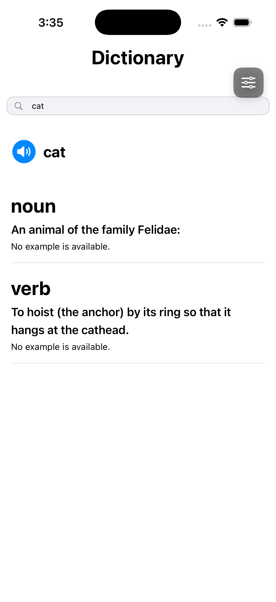
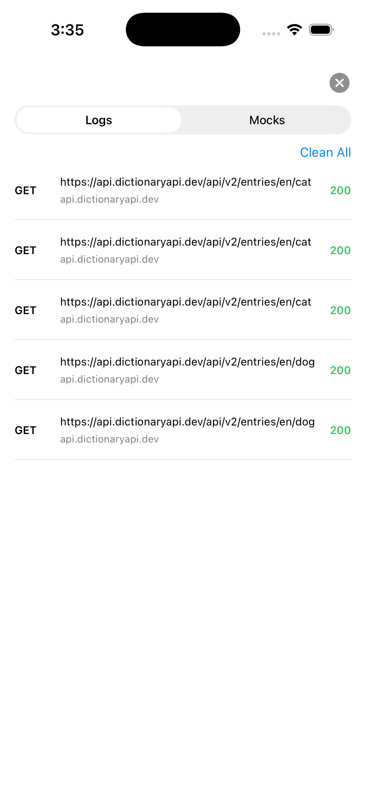
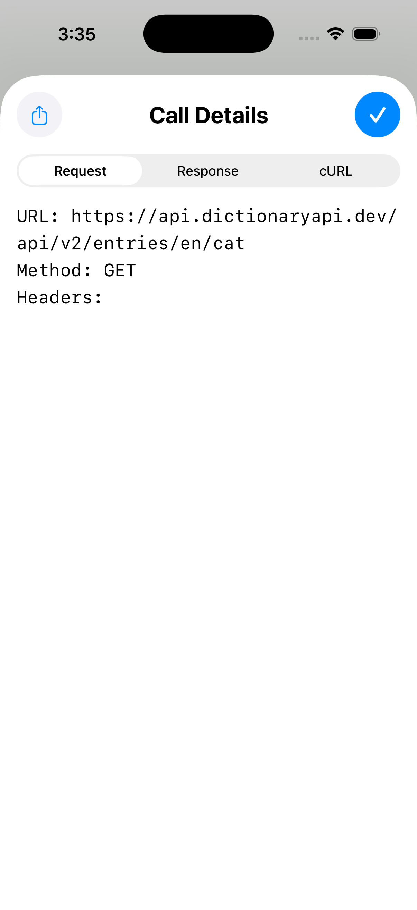
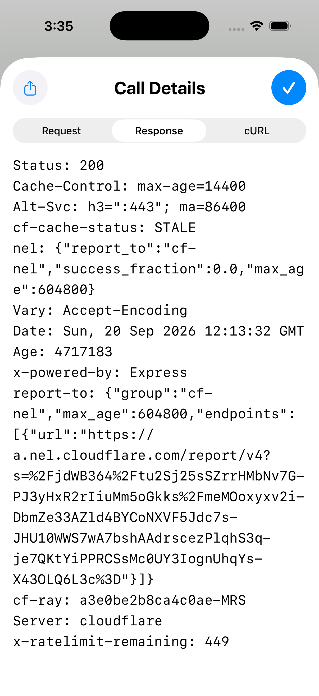
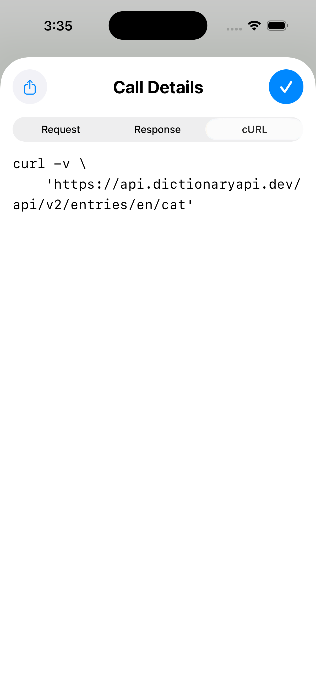
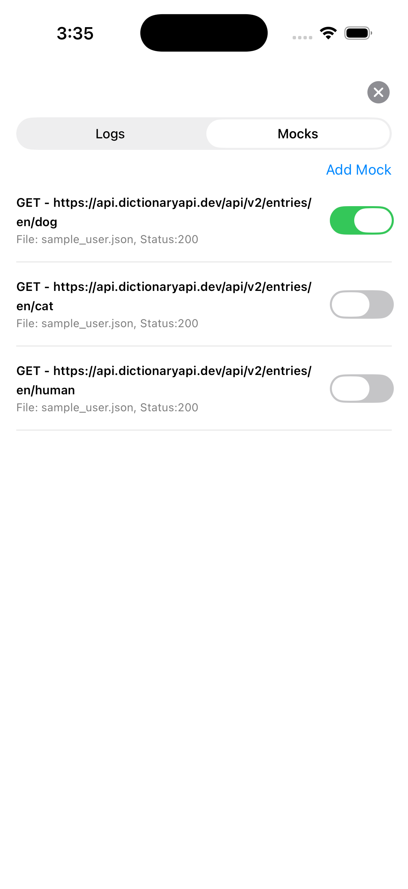

# Network Debugging Tool

An in-app network inspector and response mocker for iOS, built with SwiftUI. It sits on top of any screen as a floating overlay, watches every HTTP/HTTPS request the app makes, and lets you inspect requests/responses or replace a response with local JSON — all without leaving the app or attaching an external proxy.

Built from scratch as a hands-on study of modern iOS: the `URLProtocol` loading system, Swift concurrency (`async/await`, `Task`, `@MainActor`), the Observation framework (`@Observable`), and SwiftUI ↔ UIKit interop (`UIWindow`, `UIHostingController`, custom hit-testing).

---

## Contents

- [Features](#features)
- [Screenshots](#screenshots)
- [How it works](#how-it-works)
- [Concepts & APIs used](#concepts--apis-used)
- [Project structure](#project-structure)
- [Getting started](#getting-started)
- [Using the debugger](#using-the-debugger)
- [Adding mock files](#adding-mock-files)
- [Notes & limitations](#notes--limitations)
- [Credits](#credits)

---

## Features

- **Floating overlay** — a draggable button that stays above every screen (including presented sheets and view controllers) and opens the debugger. Touches outside the button pass through to the app.
- **Live request log** — every HTTP/HTTPS request the app makes appears in a list as it completes, newest first, with method, path, host, and a colour-coded status (2xx green, 4xx orange, 5xx / errors red).
- **Call details** — tap any logged call to inspect it across three tabs:
  - **Request** — URL, method, headers
  - **Response** — status, headers, and a pretty-printed JSON body
  - **cURL** — a ready-to-run `curl` command reproducing the request
  - Any tab's contents can be shared via the system share sheet.
- **Response mocking** — define rules that return a local JSON file instead of hitting the network. Each mock has a URL pattern, HTTP method, a bundled JSON file, and an on/off switch. Add, edit, delete, and toggle mocks from the Mocks tab; a matching enabled mock is served without any network call.
- **Demo host app** — a small Dictionary app (powered by the free [Dictionary API](https://dictionaryapi.dev/)) that generates real traffic to inspect and mock.

---

## Screenshots

_Add your images to a `Screenshots/` folder and they'll render here._

| Dictionary (host app) | Request log | Call details |
| --- | --- | --- |
|  |  |  |

| Response tab | cURL tab | Mocks |
| --- | --- | --- |
|  |  |  |

---

## How it works

The whole tool is built around one idea: **insert your own handler into the URL Loading System so every request flows through your code before it reaches the network.**

### Interception

`NetworkInterceptor` is a `URLProtocol` subclass. It's installed by building the app's `URLSession` from a patched configuration:

```swift
// DictionaryApp/Services/NetworkService.swift
private let urlSession = URLSession(configuration: NetworkDebugger.shared.interceptedConfiguration())
```

`interceptedConfiguration()` returns a `URLSessionConfiguration` with `NetworkInterceptor` inserted into its `protocolClasses`, so the app is decoupled from the interceptor — it only asks the debugger for a session and uses whatever it's handed.

For each request the session consults the interceptor:

- **`canInit`** claims `http`/`https` requests, and declines any request already tagged as one the interceptor itself forwarded (the loop guard).
- **`startLoading`** is the core. It first checks for a matching mock; if none, it forwards the request through a private `.ephemeral` session using `async/await` inside a `Task`, reports the response back through the `URLProtocolClient` callbacks, and records the completed call.
- **`stopLoading`** cancels the in-flight `Task` if the app cancels the request.

The private forwarding session (plus the request tag) is what prevents the interceptor from intercepting its own forwarded request — an infinite loop otherwise.

### Logging

Finished requests become `NetworkCall` values and are pushed into `NetworkCallStore` — a `@MainActor @Observable` store the `LogsView` binds to, so new calls appear live. The interceptor runs on background threads, so writes hop to the main actor before mutating the store.

### Mocking

Before forwarding, `startLoading` calls `activeMock(for:)`, which matches the request URL and method against the enabled mocks. On a match it reads the mock's JSON file from the app bundle, builds an `HTTPURLResponse`, and hands that back through the same client callbacks — the app receives it exactly as if it came from the server, with no network call made.

Because `URLProtocol` runs off the main thread and `MockStore` is `@MainActor`, the interceptor reads mocks from a thread-safe snapshot (`MockStore.enabledSnapshot`) that's refreshed on the main actor whenever mocks change.

### Overlay

The floating button lives in its own `UIWindow` above the app's window — the only way to sit above content the app itself presents. The window overrides hit-testing so only touches on the button belong to it; everything else falls through to the app. The button and every debugger screen are SwiftUI, hosted via `UIHostingController` — UIKit is used only for the window plumbing that SwiftUI can't express.

---

## Concepts & APIs used

| Area | APIs / techniques |
| --- | --- |
| Interception | `URLProtocol`, `URLSessionConfiguration.protocolClasses`, `URLProtocolClient`, request tagging via `URLProtocol.setProperty` |
| Concurrency | `async/await`, `Task`, `@MainActor`, structured cancellation, `nonisolated(unsafe)` for a cross-actor snapshot |
| State | Observation framework (`@Observable`, `@Bindable`), single-source-of-truth stores |
| UI | SwiftUI (`List`, `Picker`, `.sheet(item:)`, `ShareLink`), enum-driven view state |
| UIKit interop | `UIWindow` overlay, window levels, custom `point(inside:)` / `hitTest` pass-through, `UIPanGestureRecognizer`, `UIHostingController` |
| Serialization | `Codable`, `JSONSerialization` (pretty-printing) |

---

## Project structure

```
NetworkDebuggingTool/
├── DictionaryApp/              # Demo host app — generates traffic to inspect
│   ├── Models/                 # WordEntryModel
│   ├── Services/               # NetworkService (uses the patched session), AudioService
│   ├── ViewModels/             # DictionaryViewViewModel
│   └── Views/                  # DictionaryView, DetailsView, SearchBar
│
├── NetworkDebugger/            # The debugging tool
│   ├── Models/                 # NetworkCall, Mock
│   ├── Services/               # NetworkInterceptor (URLProtocol), NetworkDebugger (setup),
│   │                           #   NetworkCallStore, MockStore
│   ├── ViewModels/             # NetworkCallViewModel, LogsDetailViewViewModel, MockViewModel
│   └── View/
│       ├── OverlayView/        # OverlayWindow, OverlayButton
│       └── DebuggerView/       # DebuggerPanelView, LogsView, LogsDetailView,
│                               #   MocksView, AddMockView
│
└── NetworkDebuggingToolApp.swift
```

---

## Getting started

**Requirements**

- Xcode (latest)
- iOS 17.0+ (the project currently targets a newer iOS; the APIs used — Observation, `ShareLink` — require iOS 17+)

**Run**

```bash
git clone https://github.com/meetsingh459/Network-Debugging-Tool.git
cd Network-Debugging-Tool
open NetworkDebuggingTool.xcodeproj
```

Build and run on a simulator or device. The debugger starts automatically on launch:

```swift
// NetworkDebuggingToolApp.swift
DictionaryView()
    .task { NetworkDebugger.shared.start() }
```

Search for a word in the Dictionary app, then tap the floating gear button to open the debugger and watch the request appear in **Logs**.

---

## Using the debugger

1. **Tap the floating button** (drag it anywhere) to open the debugger panel.
2. **Logs tab** — see every request. Tap a row for full Request / Response / cURL details. **Clear All** empties the list.
3. **Mocks tab** — **Add Mock**, fill in a URL pattern, method, JSON file name, and status, then toggle it on. Search a word that matches the pattern and the mock's JSON is returned instead of the real response. Toggle it off to restore real network calls.

---

## Adding mock files

A mock's JSON file must be **inside the app bundle**, or it won't be found at runtime:

1. Drag the `.json` file into the Xcode project.
2. In the add dialog, tick **Copy items if needed** and check your **app target**.
3. Confirm it appears under **Build Phases → Copy Bundle Resources**.
4. In the Mocks tab, set the mock's file name to match exactly (e.g. `sample_definition.json`).

The file's shape must match what the endpoint returns — for the Dictionary API that's a top-level JSON **array** of entries, or the app will serve the mock but fail to decode it.

---

## Notes & limitations

- A developer debugging tool — it favours clarity and inspectability over production hardening.
- Requests are inspected only if they go through a session built from `NetworkDebugger.interceptedConfiguration()`. The demo app's `NetworkService` does this; a real integration would route its sessions the same way.
- Mocks are held in memory and reset on relaunch (no persistence).
- Mock matching is a substring match on the URL plus an exact method match.
- Mock responses are served with a `200` status and no custom headers.
- iOS only.

---

## Credits

- Demo data from the free [Dictionary API](https://dictionaryapi.dev/).
